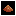

# sand-game-2
Expanded version of Cypress Ranch Computer Science II "Falling Sand" project.

## Table of Elements

|  | Name | Description |
| ----------- | ----------- | ---|
| | Empty     | Erases other elements  |
| | Gas     | Inert substance that flows upwards and dissipates  |
| | Acid Gas     | Lingers for longer than gas and poisons life  |
| | Hydrogen  | Extremely flammable gas|
| | Fire   | Spreads over flammable objects triggers explosions  |
| | Blue Fire   | Hotter and longer-lasting fire  |
| | Acid   | Melts through most materials |
| | Alcohol   | Flammable liquid that can poison life |
| | Snow   | Falls slowly and freezes water 
| | Water   | Flows into containers and supports life |
| | Ice   | Creates crystal patterns in water|
| | Fairy   | Flutters in the air, magically transforms toxic substances, and is immune to fire|
| | Polliwog   | Creates colonies in water, eats algae and urchins |
| | Urchin   | Creates colonies in water, eats polliwogs |
| | Spore   | Grows into fungus in presence of dirt and water |
| | Algae   | Flammable blankets of life in water |
| | Mercury   | Destroys all life |
| | Sand   | Basic falling particles, turns into glass when burned |
| | Magic Sand   | Falls sideways to the right |
| | Sand Duck  | Creates colonies in the sand, eats urchins and fungus |
| | Penguin   | Creates colonies in the ice/snow, eats urchins and polliwogs |
| | Dirt   | Basic falling particles |
| | Lava   | Extremely hot liquid that cools into rock and starts fires |
| | Glass   | Basic structural particles |
| | Rock   | Weathers into dirt when touching water and can melt to lava |
| | TNT   | Extremely explosive solid material |
| | Slime   | Grows inside of acid and dissolves into acid gas when harmed |
| | Metal   | Basic structural particles, can melt into mercury |
| | X-tap   | Spawns material X around it |
| | Diamond   | Indestructible material |
